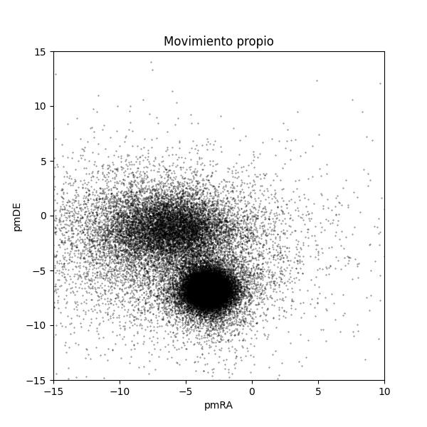
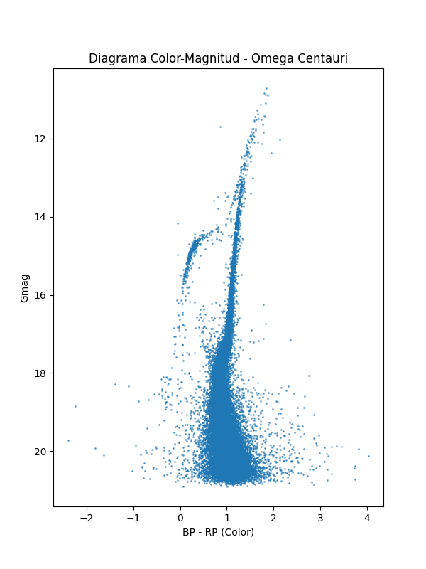

# Arqueología Galáctica y el Misterio de Omega Centauri

Omega Centauri destaca por encima de otros cúmulos globulares porque, según la evidencia, podría ser el remanente de una galaxia enana absorbida por la nuestra. Lo que se busca con este trabajo es aplicar el análisis de movimiento propio para filtrar la muestra. El objetivo es separar las estrellas reales del cúmulo de las estrellas del disco galáctico que se cuelan en la imagen por puro efecto visual.

---

## Datos
Desde la interfaz de **SIMBAD** se utilizaron las coordenadas precisas:

| Parámetro | Valor Original (HMS/DMS) | Grados Decimales |
| :--- | :--- | :--- |
| **RA (Ascensión Recta)** | 13h 26m 47.28s | **201.69699°** |
| **DEC (Declinación)** | -47° 28' 46.1" | **-47.47947°** |

---

## Metodología

### 1. Descarga de Datos
Se utlizo un script en Bash (`1_descarga_omega.sh`) para realizar una consulta ADQL al catálogo **Gaia DR3** mediante el endpoint de VizieR. Se extrajo un radio de 0.5° con las siguientes columnas: `Source`, `RA_ICRS`, `DE_ICRS`, `pmRA`, `pmDE`, `Gmag`, `BPmag`, `RPmag`.

### 2. Limpieza y Base de Datos
Debido a que los datos astronómicos suelen venir con caracteres raros y símbolos que estorban, el script `2_crear_db.py` se encargó de lo siguiente:

* **Limpieza de metadatos** y de todas las líneas de relleno que traía el archivo.
* **Paso de los datos a números** (`float`) para poder trabajar con ellos.
* **Eliminación de las filas** que estaban vacías o no servían.
* **Guardado de todo** de forma organizada en una base de datos **SQLite** (`arqueologia.db`).

### 3. Análisis

La clave de todo fue graficar el **Movimiento Propio** (`pmRA` vs `pmDE`). Al hacer esto, se vio claramente un "racimo" de estrellas muy apretado que no estaba en el centro (0,0). Esto confirma que el cúmulo se mueve como un solo grupo unido. 

Para limpiar el ruido y dejar solo las estrellas que interesan, se usó este filtro en SQL:

```sql
SELECT * FROM estrellas 
WHERE pmRA BETWEEN -6 AND -2 
AND pmDE BETWEEN -9 AND -5
```
---

## Ejecución del proyecto

Para facilitar la ejecución de todo el flujo, se creó un script (`run_pipeline.sh`) que corre automáticamente todos los pasos: descarga de datos, creación de la base de datos y análisis.

De esta forma, solo es necesario ejecutar:

```bash
./run_pipeline.sh
```

---

## Resultados

### Gráfica 1
En este gráfico de dispersión se ve claramente cómo el movimiento de Omega Centauri se separa de lo que es el fondo galáctico. Ese punto donde las estrellas están más apretadas representa al grupo que se mueve unido por la gravedad.



### Gráfica 2
Ya con el filtro aplicado, se calculó el índice de color ($BP - RP$) y se graficó la Magnitud G invertida. 

Lo importante aquí es comparar qué pasa antes y después del filtro. Sin aplicar el filtro en SQL, el diagrama HR aparece bastante desordenado, ya que incluye estrellas de la Vía Láctea que no pertenecen al cúmulo. Estas estrellas “intrusas” generan ruido y hacen difícil ver una estructura clara.

Después de aplicar el filtro basado en movimiento propio, el diagrama cambia notablemente: la distribución se vuelve mucho más limpia y se empiezan a distinguir mejor las estructuras típicas como la secuencia principal y la rama gigante.

Esto demuestra que el uso de SQL para filtrar por cinemática permite eliminar la contaminación de fondo y aislar una población estelar coherente.



---

## Conclusión

Al final, usar el movimiento propio es lo que realmente permite que todo esto funcione. Sin esa herramienta, sería un lío separar qué estrellas son de qué lugar. Gracias a ese filtro, se pudo limpiar todo lo que estorbaba para dejar a Omega Centauri solo, logrando que el diagrama se vea bien y tenga sentido.

Todo esto confirma que Omega Centauri no es una parte normal de la Vía Láctea, sino que se nota que viene de otro lado. Los datos encajan perfecto con la idea de que en realidad es lo que quedó de una galaxia enana que nuestra galaxia terminó atrapando hace muchísimo tiempo.


---

## Declaración de Uso de IA

Para este proyecto usé IA como apoyo en varias partes:

* Me ayudó a armar y darle formato a este `README.md` porque no sabía muy bien cómo estructurarlo.
* Me sirvió para arreglar errores en el código, especialmente para leer los archivos que venían con espacios y caracteres raros.
* La usé para que los scripts de las gráficas funcionaran mejor y no se vieran tan simples.
* Pero toda la lógica de los filtros SQL y entender qué significan los resultados astronómicos lo hice por mi cuenta para aprender bien el tema.